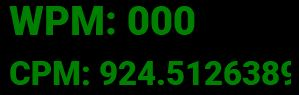
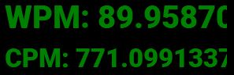
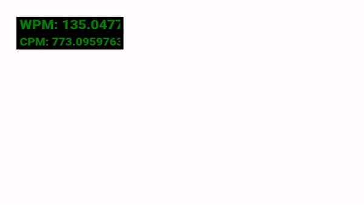
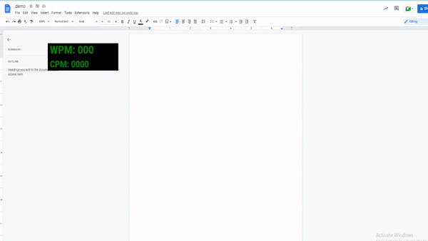

# WPM Counter Project

The aim of this project is to display in real-time the (1) words-per-minute (WPM) rate, and (2) characters-per-minute (CPM) rate.

---

## How to run currently

```
> python main.py
```

## Required packages to build from source
```
1. PyQt6
2. pynput
```

## Visuals

The application begins as the following:


When we start writing, the CPM will immediately change:



When we write some text, then press SPACE, the program records a new word. We also record the timestamps between words. Writing a word results in changing the WPM measure:



Finally, this window is draggable for the purposes of your comfort! You can drag the window by pressing the left mouse click and dragging:



A typical usage of this application is to keep track of how fast we are typing in real-time with an application such as Word or Google Docs:



<span style="color:red"> \*WARNING\* </span> Keep in mind that this application is *NOT* meant to officially track your true typed character per minute and words per minute. This application is meant to report self-contained words per minute and characters per minute measurements based on an event-based algorithm.
This application should not be used to prove or disprove true WPM and CPM abilities of users. Instead, the purpose of the application is meant as a real-time informative interface. <span style="color:red"> \*WARNING\* </span>